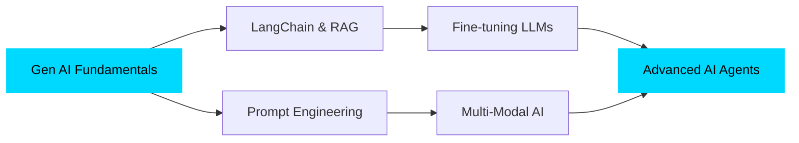

<div align="center">
  
</div>

<div align="center">
  
  [](https://git.io/typing-svg)
  
</div>

<br>

##  About Me

```python
class Developer:
    def __init__(self):
        self.name = "Harshit Bhatt"
        self.role = "AI/ML & Game Development Enthusiast"
        self.location = "Earth-616 🌍"
        self.current_focus = [
            "AI-powered desktop tools (Video summarization, Deepfake detection)",
            "Generative AI & LLMs based learning and development",
            "Building practical ML solutions",
            "Game development with creative mechanics"
        ]
        self.learning = ["Advanced Gen AI", "LangChain", "Ollama", "RAG Systems"]
        
    def say_hi(self):
        print("Thanks for dropping by! Let's build something amazing together 🚀")

me = Developer()
me.say_hi()
```

<br>

## 🛠️ Tech Stack & Tools

<details open>
<summary><b>🧠 AI/ML & Data Science</b></summary>
<br>


</details>

<details open>
<summary><b>🤖 Generative AI & LLMs</b></summary>
<br>


</details>

<details open>
<summary><b>💻 Languages & Frameworks</b></summary>
<br>


</details>

<details>
<summary><b>📱 Mobile & Desktop</b></summary>
<br>


</details>

<details>
<summary><b>🔧 Tools & Platforms</b></summary>
<br>


</details>

<br>

## 🚀 Featured Projects

<table>
<tr>
<td width="50%">

### 🤖 AI Multi-Tool Desktop App
**Modular AI-powered application with:**
- 🎥 Video Summarizer
- 🎭 Deepfake Detector  
- 💬 Text-to-SQL Converter

**Tech:** Python • Ollama • LLaMA 3.2 • Tkinter

</td>
<td width="50%">

### 🏥 Health & Nutrition Calculator
**Comprehensive health planning suite:**
- BMI & Calorie Calculator with visual gauges
- Macro/Micronutrient planning
- Weight loss/gain journey planner
- 20+ vitamins & minerals database

**Tech:** Python • Tkinter • Glassmorphism UI

</td>
</tr>

<tr>
<td width="50%">

### 🎮 Memory Match Deluxe
**Polished card matching game:**
- Multiple game modes & difficulties
- Challenge systems (Countdown, Limited Moves)
- Avengers-themed badges
- Web Audio API integration

**Tech:** Vanilla JavaScript • HTML5 • CSS3

</td>
<td width="50%">

### 🎮 Tetris Python
**Classic arcade game recreation:**
- Smooth gameplay mechanics
- Score tracking & levels
- Classic Tetris controls
- Retro gaming experience

**Tech:** Python • Pygame

</td>
</tr>

<tr>
<td width="50%">

### 📊 AQI Prediction Model
**Machine learning for air quality:**
- Time series forecasting
- Data visualization
- Environmental analysis

**Tech:** Python • Scikit-learn • Pandas • Matplotlib

</td>
<td width="50%">

### 🎯 Recommendation System
**Intelligent recommendation engine:**
- Collaborative filtering
- Content-based recommendations
- User preference analysis

**Tech:** Python • NumPy • Pandas

</td>
</tr>
</table>

<br>

## 📊 GitHub Stats

<div align="center">
  
  
</div>

<div align="center">
  
  
</div>

<br>

## 🏆 GitHub Trophies

<div align="center">
  
</div>

<br>

## 💡 Current Learning Path



<br>

## 🎯 2026 Goals

- [ ] 🚀 Build 3 production-ready Gen AI applications
- [ ] 📚 Master LangChain and advanced RAG techniques
- [ ] 🎮 Release 2 complete games with unique mechanics
- [ ] 🤝 Contribute to 5 open-source AI/ML projects
- [ ] 📝 Write technical blogs on Gen AI development
- [ ] 🏆 Win a hackathon with an AI-powered solution

<br>

## 📫 Let's Connect!

<div align="center">
  
[](https://www.linkedin.com/in/harshit-bhatt-a1440b290)
[](https://github.com/Cykikz)
[](mailto:your.email@example.com)

</div>

<br>

## 💭 Random Dev Quote

<div align="center">
  


</div>

<br>

## 📈 Profile Views

<div align="center">
  


</div>

---

<div align="center">
  
### 💬 *"The best way to predict the future is to invent it."* - Alan Kay


</div>
